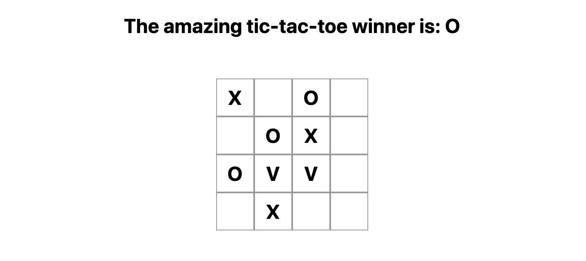

# 0. **Welcome and Run Template Project** 
Hello all Berliner Code Pubers! In this workshop, we will be creating a small Tic-Tac-Toe game in the JavaScript framework [Vue.js](https://vuejs.org/). 


---
## 0.1 **How to read this Readme**
---
To easily follow this Workshop and Readme, the Readme is structured according to a few conventions. 

- Code and file names are written as `CodeExample`.
- Larger code snippets are writting in block, where the file name is included as a comment on the top, for example as 
```
// File Name

Newly added code together with some older code to understand where the new code should be put in
```
- If there are previous written code in the same file as the new code, this is implied by

```
/* ... */ (Previous code written)
```
- When Vuejs concepts or other important words are mentioned, they are written in bold, as **Vue Concept**

- If there are some deeper explainations to either concepts or why, these are written as the citation shown below. These can be skipped depending on how much in detail you want to go. 
> Example explaination of a concept

---
## 0.2 **Intro to the project**
---
If you are using an internal editor on your computer, you can fetch the basic project from the github repository [here](https://github.com/LovreB/vue-tic-tac-toe). Otherwise, just continue on here at [Vue.js playground](https://sfc.vuejs.org/). 

The template consists of three different Vue.js files - `App.vue`, `Board.vue` and `Square.vue`, where each file represents a **Vue component**. A Vue Component is a resuable block, which can contain other components or other html content. A Vue application contains one root Vue component, which in turns contains other **child components**. In our application, `App.vue` is the root component. 
<a name="component-tree"></a>


---
# 1. **Setting Up the Board**
The first task is to set up the board with nine squares, and fill a square with and `X` when clicked.  

Inspecting our root compoment `App.vue` file, there are three different parts. First is the template part, where the HTML template of the component is defined. If the compoment includes other components, they are added in a tag here, like `<Board />`. 

````
<template>
  <h2>HELLO CODE-PUBERS!</h2>
  <div class="board-container">
    <Board />
  </div>
</template>
````
A script part where the logic and data is added - here written in TypeScript. 
````
<script setup>
import Board from "./Board.vue"; // Imports the Board component so that it can be used in the template

</script>
````
And lastly, a style part with css. This workshop will not care about the styling - but feel free to modify if you want to. 
```
<style>
h2 {
  text-align: center;
}
.board-container {
  margin: auto;
  max-width: 138px;
  padding-top: 30px;
}
</style>
```

Running your app - either locally or checking the preview in Vue.js Playground - should display two texts - the Hello Codepubers heading, and The Board which is the Board component. 


---
## 1.1 **Add your first squares**
---
Recall the [component tree](#02-intro-to-the-project) - we will now add nine *Square* components as children to the *Board* component. 

In `Board.vue`, the template needs to be updated to include the *Square* component. In order to include the *Square*, it has to be imported in `Board.vue`, which is done in the script part. Update `Board.vue` with the code below.
```
// Board.vue

<template>
  <Square />
</template>

<script setup>
import Square from './Square.vue'
</script>

/* ... */
``` 
You should now be able to see a single square in the preview. 

But a board does not consist of one square, right? Nine squares are included in a board, and to remember the values of every square (`X`, `O` or empty), a data representation is needed. In the script, add
```
// Board.vue

const boardSquares = ref(Array(9).fill('X'))
``` 
This creates a **reactive** variable, where the value, i.e. the array, later on can be used using `boardSquares.value`. 

> Reactive variables enforces the component to update appropirate parts when the inner value, i.e. the value contained in `.value`, is being updated. Read more about reactive variables [here](https://vuejs.org/api/reactivity-core.html#ref)

For each of the values in `boardSquares`, we want to add an actual square in the template so that the squares are visible. This is done via the **Vue directive** `v-for`. In the template, replace `<Square />` with 

```
// Board.vue

<Square 
  v-for="(value, index) in boardSquares"
  :key="index"/>
``` 
This will create one square for every value in `boardSquares`, resulting with nine squares in the preview. 

> Vue Directives are special attributes with the `v-` prefix, which should update the rendering when the value of them changes. `v-for` takes an array, and create one vue element for every value in that array. Always when using `v-for`, a unique key also has to be included. More about directives and v-for can be found [here](https://vuejs.org/api/built-in-directives.html#v-for)

---
## 1.2 **Filling the squares with props**
---
In Vue.js, data bindings are an essential concept - data are being passed between components, and a component is re-rendered as soon as data is updated. When data is passed between parent - children, this is done via the components **props**.
To your `Square.vue`, add the 

```
// Square.vue

<template>
  <span class="square">{{ value }}</span>
</template>

<script setup>
defineProps({
  value: String,
});
</script>

/* ... */
```

To define the possible props for a component in Vue, `defineProps` is used. Here, we tell our component that we want to have a prop called `value`, which should be a string. To display the prop in the template, we are using curly braces - `{{ }}` - around the prop. 

> Whenever a value within `{{ }}` is updated, so is the rendered component.

Next step is to pass the value in the `boardSquares` array to the correct square in `Board.vue`. This is achieved by binding the `square` to the `value` prop, by adding the attribute `:value="value"` in our v-for, resulting in 

```
// Board.vue

<Square 
  v-for="(value, index) in boardSquares"
  :key="index"
  :value="value"/>
```

There should now be an `X` in every square.

---
## 1.3 **Only fill square when clicked**
---
To avoid having a pre-filled board, the next task is to only fill a square with `X` when it is clicked. To achieve this, we need a method which sets the correct value of a square, and change the initial state of a square to be empty. Let's add the `updateBoard` function, which takes an index as input and updates the value in that index to `X`. 

```
// Board.vue
<script setup>

/* ... */
const boardSquares = ref(Array(9).fill(null));

const updateBoard = (index) => {
  boardSquares.value[index] = "X";
};

</script>
```
Due to `boardSquares` being a reactive variable, all components that are using the value of `boardSquares` will be updated when `boardSquares` is updated. 

However, nothing is happening on the screen - because `updateBoard` are not yet used anywhere. To call `updateBoard` when a square is clicked, we need to add an **onClick event listener** to our *square* components by using the directive `v-on` (shorthand `@`). 

Add `@click=updateBoard(index)` to the square component. The `updateBoard` function is now called once we click a single square, together with the index of the clicked square.

---
# 2. **Alternating players and compute winner**
Next step is to add multiple players alternating their turns! 

---
## 2.1 **Alternating players**
---
To add two players that artineratively take turns, we need a state keeping track on whos turn it is. Add a new reactive variable in `Board.vue` with
```
// Board.vue

<script setup>
/* ... */ 

const isNext = ref('X') 

/* ... */ 
</script>
```
Next up is to modify `updateBoard` to both use `isNext` and toggle the player. 
```
// Board.vue

<script setup>
/* ... */ 

const updateBoard = (i) => {
  boardSquares.value[i] = isNext.value;
  isNext.value = isNext.value === "X" ? "O" : "X";
};

</script>
```
> What happened here? We are setting the `isNext.value` depending on the outcome of the line `isNext.value`. If it equals `X`, set `isNext.value` to `O`, and set it to `X` otherwise.

Now you should se `X` and `O` alternatively being filled in the squares. 

---
## 2.2 **Compute winner**
---
But when does the game end? When someone gets three in a row! Add the computed property below to compute the winner.

```
// Board.vue

<script setup>
/** ... **/

const winner = computed(() => {
  const squares = boardSquares.value;
  const lines = [
    [0, 1, 2],
    [3, 4, 5],
    [6, 7, 8],
    [0, 3, 6],
    [1, 4, 7],
    [2, 5, 8],
    [0, 4, 8],
    [2, 4, 6],
  ];
  for (let i = 0; i < lines.length; i++) {
    const [a, b, c] = lines[i];
    if (squares[a] && squares[a] === squares[b] && squares[a] === squares[c])
      return squares[a];
  }
  return null;
};
</script>
```
In `updateBoard`, we need to check if there is a winner in every update. Also, the check should include if the square already has a filled value - if so, we do not want to update the value of the square or change the user. 
```
// Board.vue

<script setup>
/* ... */ 

const updateBoard = (i) => {
  if (winner.value || boardSquares.value[i]) return;

  boardSquares.value[i] = isNext.value;
  isNext.value = isNext.value === "X" ? "O" : "X";
};

</script>
```
You should now have a game that stops if anyone has won, and where it is not possible to click a square that already is filled. 

---
# 3. **Displaying the winner by lifting state up**
The final step is to display whose turn it is or, if someone has won, the winner. To do this, alter the text displayed in `App.vue`.

---
## 3.1 **Pre work - lifing state up**
---
To be able to use whose turn it is or if someone has won, we are going to "lift our state up" - i.e. move the logic from `Board.vue` to `App.vue`. Lets start with `boardSquares` - move them from being a reactive variable in `Board.vue`, to `App.vue`, and send the `boardSquares.value` as prop down to the Board component. The prop is declared in `Board.vue` with `defineProps`. 

```
// Board.vue

<script setup>
import { ref } from "vue";
import Square from "./Square.vue";

const props = defineProps({
  boardSquares: {
    type: Array,
  },
});

/* ... */
</script>

// App.vue

<template>
  <h1>HELLO CODEPUBERS!</h1>
  <div class="container">
    <Board :boardSquares="boardSquares" />
  </div>
</template>
<script setup>
import { ref, computed } from "vue";
import Board from "./Board.vue";

const boardSquares = ref(Array(9).fill(null));

/* .. */ 
</script>
```
However, this should generate a warning as we are trying to update a prop from the child in our `updateBoard` function.

> In Vue.js, you should never update a prop from the child. This is always done through the parent which is passing the prop down. 

Next we want to lift all the logic up - `calculateWinner`, `updateBoard`, and `isNext` should be moved to `App.vue`. 

This will return a new error - *updateBoard does not exist*. Since we are calling `updateBoard` from our template in `Board.vue`, we need to change that as well.

>There are different ways of implementing this logic. Lifting the state up is only one out of multiple possible solutions.

## 3.2 **Send events from child to parent using emit**

Instead of calling `updateBoard`, we want to tell our parent (the app component) that an action has taken place. If we only would use `@click` on the Board component, we have no information about what square was used. Instead, we need another way. 

For communication from child to parent, Vue has a concept called `emit` - and you are **emitting events** from the child to parent, and listens to that event with the `v-on/@` directive in the parent. We call our event `squareClicked`, and we start with defining in `Board.vue` that this event can be emitted by using `defineEmits`, and changing the `@click`. 

```
// Board.vue

<template>
  <Square
    v-for="(value, index) in board"
    :key="index"
    :value="value"
    @click="emits('squareClicked', index)"
  />
</template>
<script setup>
/* ... */

const emits = defineEmits(["squareClicked"]);

</script>
```
In `@click="emits('squareClicked', index)"`, we are telling our component to emit `squareClicked`, with the payload `index` (so that the parent knows the index of the square which was clicked). 

## 3.2 **Add winner text with computed property**
Now we will print the name of the winner, or print whose turn it is next. Replace `Hello Codpubers` with a so called **computed property**. A computed property in Vue.js is a value which depends on other variables, and is updated when they are updated. Add the computed property to `App.vue` with the following code: 

```
// App.vue

<script setup>
/* ... */

const nextTurnText = computed(() => {
  const winner = calculateWinner(board);
  return winner.value
    ? `The amazing tic-tac-toe winner is: ${winner.value}`
    : `Next up is: ${isNext.value}`;
});

</script>
```
Here, we first check if anyone has won - if there is a winner, we add a text telling whos is the winner. Otherwise, we print who is next up. 

To display this in your template, change `<h2>` to display our `nextTurnText`

```
// App.vue
<template>
  <h2>{{ nextTurnText }}</h2>
  /* ... */
</template>
```

Congratulations - you have now created your own tic-tac-toe game in Vue.js! To extend the application, you can now either select one of the extension proposed below, or add other features according to your choice (imagination has no limit :yay-frog:). If you don't know how to implement it, it is just to ask.

# 4. **Extensions** 

To further challenge yourself, you can select one (or multiple!) of the extensions below - they are not dependent on each other. The hints given will also bli slightly more difficult, so that you need to figure the solutions out yourself using your new Vue.js tools in your toolbox. 

---
## Extension A - Replay game and display user names
---
After this extension, the tic-tac-toe game will include a replay button, which when clicked, will prompt you to type in the user symbol and name of the players. The players name will also be visible in the title. 

### A.1 **Adapting player model to support names**
To support both a name, and the value which is filled in the square (hereafter called *token*), we need to change the player model. In `App.vue`: 

- Create a new reactive variable `players`, with 
- Update the `isNext` variable to be the index of the current player, instead of the token of the current player.
- Add a computed property `nextPlayer`, which returns the correct player from the `players` array, based on the `isNext` index.

### A.2 **Display player name in title**
When the player model has been changed, we should update the title to display both the name and the token of the next or winning player. 
- Update `nextTurnText`, so that it displays both the next players name and token. 
- Update the `winner` computed property so that it returns the player, and not only the token of the winning player. (Hint: you can use `Array.find()`, documentation found [here](https://developer.mozilla.org/en-US/docs/Web/JavaScript/Reference/Global_Objects/Array/find))

### A.3 **Component to add dynamic user names**
Instead of having our own hardcoded (or none) names, enable the entering of user selected user names.

- Create a new vue component `SignUp.vue` and include it in the `App.vue` template
- Create two reactive variables `playerOneName` and `playerTwoName`.
- Add two inputs (`<input />`), binding to the names variables by using the vue directive `v-model`.
- Create a new function `emitPlayerNames`. This function should emit playerOneName and PlayerTwoName - if they are not empty! (Hint: don't forget to specify `defineEmits`!).
- Add a button (`<button>`), and call `emitPlayerNames` on click!

### A.4 **Put it all together**

- Add current code in `App.vue` to a new component, `Game.vue`. 
- Change the `players` variable to be a prop in `Game.vue`. (Hint: Don't forget to remove `player.value` and use only `props.player`)
- In `App.vue`, add `players` as a reactive variable and also create a `updatePlayers` function which takes an array `playerNames` as input, and sets the `players.value` to a new array including the names and tokens (Hint: use `X` and `O` as hardcoded tokens). 
- Add a Game component and a SignUp component to the `App.vue` template. Use the vue directive `v-if="players"` and `v-else` on the Game and SignUp Components, respectively.


## Extension B - Style board depending on state
- Mark background / numbers on winning row
- need to return the index of the winning squares
- Also change X O to use different backgrounds instead

## **Extension C - Three-player-game**
The task of this assignment is to extend our game to be three-players playing on a 4x4 board, what will look sort of like: 



### C.1 **Adjust number of players**


### C.2 **Adjust size of board**

- Use 4x4 board
- Fix algo
- Update user

## Extension D - Explore Life Cycle Hooks and Router
- Add an external "user settings" page on another site
- Select X O symbols
- use state for this and router link navbar. 
